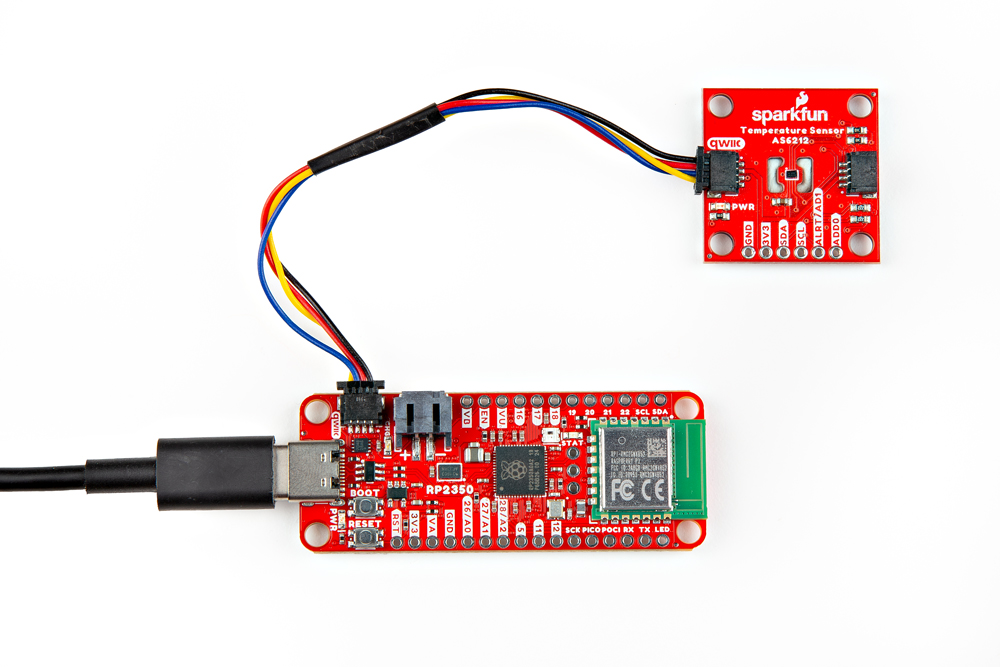

<!-- This section covers any assembly steps needed to complete the guide. Can be very simple but should include a simple assembly (Qwiic, USB, etc.) and a Soldered Assmebly section link to the PTH Soldering Tutorial-->

## Qwiic Assembly

Basic assembly of the Thing Plus - RP2350 just requires plugging the board in over USB-C to upload firmware and/or start programming with it. SparkFun offers a variety of Qwiic breakout boards with Python libraries like the [AS6212 Temperature Sensor Breakout]() connected to the board in the photo below:

<figure markdown>
[{ width="600"}](./assets/img/Thing_Plus_RP2350-Qwiic_Assembly.jpg "Click to enlarge")
</figure>

## Soldered Assembly

-   <a href="https://learn.sparkfun.com/tutorials/5">
    <figure markdown>
    
    <figcaption markdown>How to Solder: Through-Hole Soldering</figcaption>
    </figure>
    </a>

??? note "New to soldering?"
	If you have never soldered before or need a quick refresher, check out our [How to Solder: Through-Hole Soldering](https://learn.sparkfun.com/tutorials/how-to-solder-through-hole-soldering) guide.
	

		<a href="https://learn.sparkfun.com/tutorials/5">
		 
        How to Solder: Through-Hole Soldering</a>
	

