Let's take a closer look at the RP2350 and other hardware components on this Thing Plus board.

## RP2350 Microcontroller

The RP2350 from Raspberry Pi packs a whole lot of computing punch in a tiny package. The RP2350 is a unique dual-core microcontroller that has <i>four</i> internal processors (two Arm Cortex-M33 and two Hazard3 RISC-V processors @150 MHz), though you can only select any two of these four to run at the same time. 

<figure markdown>
[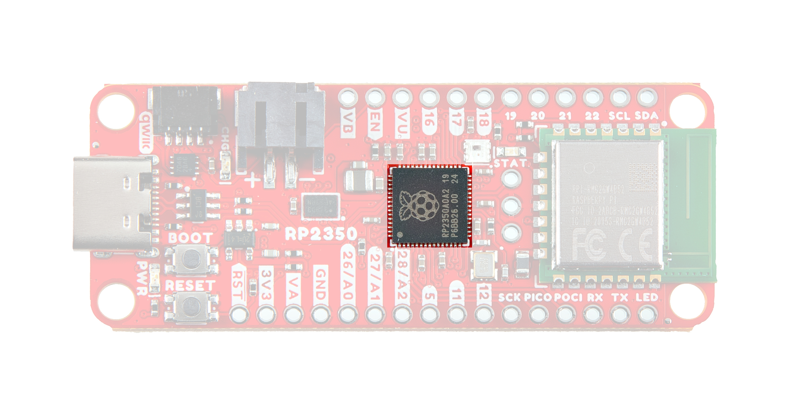{ width="600"}](./assets/img/Thing_Plus_RP2350-RP2350.jpg "Click to enlarge")
</figure>

This internal configuration allows users to customize the chip to use a pair their preferred architecture (ARM or Hazard3) or to use one of each! The RP2350 includes 520kB of on-chip SRAM in ten independent banks, 8kB of one-time-programmable (OTP) storage and this board also includes PSRAM connected to the chip's QSPI bus. The RP2350 also has a bevy of security features including optional boot signing with protected OTP storage for the boot decryption key, global bus filtering (based on either Arm or RISC-V security and privilege levels) and more.

The Thing Plus - RP2350 uses the "A" version of the microcontroller which has 30 5V-tolerant GPIO with 4 analog inputs and also includes the following peripheral options:

* 2x UART
* 2x SPI
* 2x I2C
* 24 PWM
* USB 1.1 Controller
* 12 PIO State Machines
* 1x High-Speed Transmit (HSTX) Peripheral for DVI/DSI support

For complete information on the RP2350, refer to the [datasheet](./assets/component_documentation/rp2350-datasheet.pdf).

## Memory

### W25Q128 Flash

The W25Q128 Flash IC adds 16MB of storage space on the Thing Plus. This connects to the RP2350 over QSPI.

<figure markdown>
[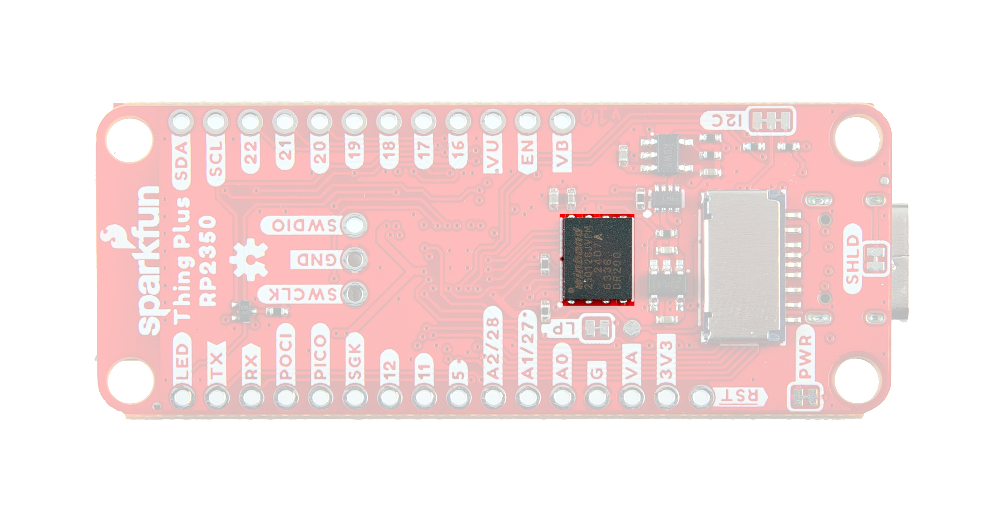{ width="600"}](./assets/img/Thing_Plus_RP2350-Flash.jpg "Click to enlarge")
</figure>

### PSRAM

The board also includes an 8MB PSRAM IC for dynamic storage. This also connects to the RP2350 over QSPI. PSRAM support is included in the SparkFun MicroPython "early release" firmware found later in this guide and on the product page, but is not natively supported in the Pico SDK as of release. Refer to the Arducam Demo section of this guide for information on how to enable and set up PSRAM using the Pico SDK.

For a complete overview of the PSRAM IC, refer to the [datasheet](./assets/component_documentation/APS6404L_3SQR_Datasheet.pdf).

### &micro;SD Card Slot

The board has a &micro;SD card slot that connects to the RP2350's SPI bus for even more storage. Make sure the SPI are **LOW** when the &micro;SD card is **unpowered**. Setting these pins **HIGH** can damage the GPIO pins. The connector is a fricton-fit connector so no "clicking" and "unclicking" is necessary. Just plug it in nice and snug. 

<figure markdown>
[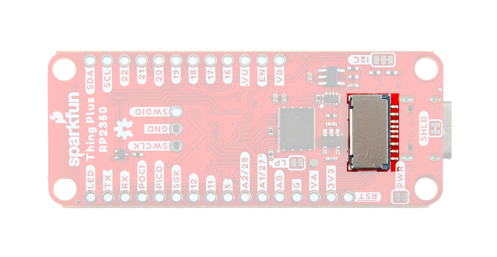{ width="600"}](./assets/img/Thing_Plus_RP2350-SD.jpg "Click to enlarge")
</figure>

## Raspberry Pi RM2 Radio Module

The Raspberry Pi RM2 (radio module 2) is built around the same chipset as the previous Raspberry Pi radio module found on boards like the Pico W. The module features both WiFi 4 (802.11n) 2.4GHz and  Bluetooth&trade; 5.2 with support for Low Energy (Central and Peripheral) and Classic. 

<figure markdown>
[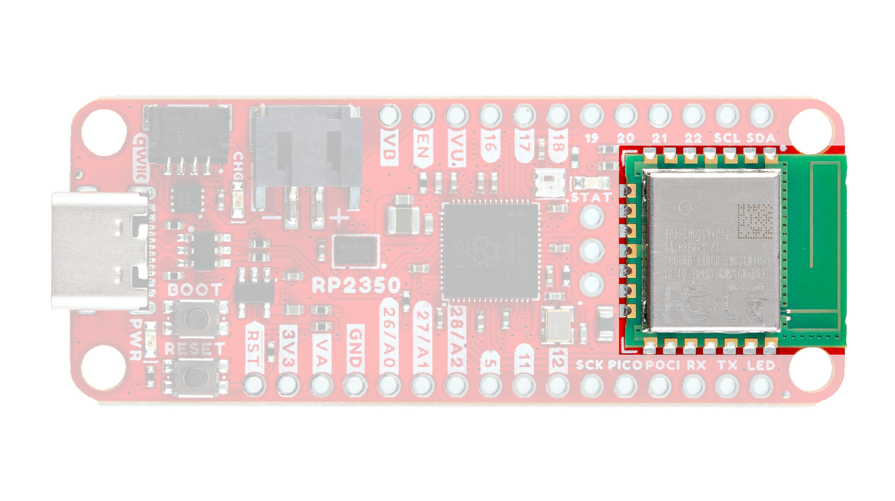{ width="600"}](./assets/img/Thing_Plus_RP2350-RM2.jpg "Click to enlarge")
</figure>

The RM2 communicates with the RP2350 over SPI and we've designed this board to use the same pins for the radio module as official Raspberry Pi boards (Pico W and Pico 2 W), making it easy to use the radio module without having to adjust anything from those development boards. The Thing Plus routes the module's GPIO0 pin to a blue STAT LED to allow users to create a visual indicator of the status of the module. We added this STAT LED connected to the same pin used on the Pico W to make code for that compatible with the Thing Plus - RP2350.

## Power Components

The Thing Plus - RP2350 includes several options for powering including USB-C, LiPo battery with on-board battery charging and monitoring circuits as well as direct power inputs.

<figure markdown>
[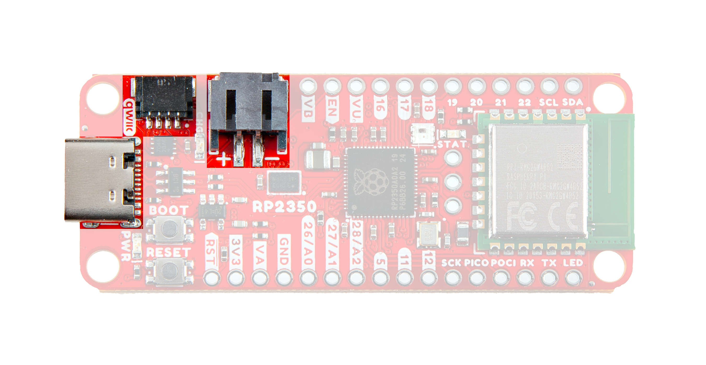{ width="600"}](./assets/img/Thing_Plus_RP2350-Connectors.jpg "Click to enlarge")
</figure>

### USB-C Connector

The USB-C connector on the board acts as the primary serial interface for the RP2350 as well as a power input. The <b>5V</b> USB input voltage is regulated down to <b>3.3V</b> through a voltage regulator with a max current of <b>500mA@3.3V</b>.

### 2-Pin JST Connector, Battery Charger, & Fuel Gauge

!!! danger "WARNING: LiPo Battery Connector Polarity"
	The LiPo battery connector on v10 of the Thing Plus - RP2350 is <b>reversed</b> from SparkFun's normal 2-pin JST battery connection. If you are using this board with a battery, follow the silkscreen markings on the board for correct polarity. This means v10 is <b>incompatible</b> with all single-cell LiPo batteries SparkFun carries. We have a fix incoming and v11 of this board will resolve this issue. We'll update this and all other notes about this error once that version is released. 

??? note "Want some LiPo battery care tips?"
	Check out our <a href="https://learn.sparkfun.com/tutorials/single-cell-lipo-battery-care">Single Cell LiPo Battery Care tutorial</a> for some helpful tips on handling and caring for them.
	

		<a href="https://learn.sparkfun.com/tutorials/single-cell-lipo-battery-care">
		 
        Single Cell LiPo Battery Care</a>
	

The board has a 2-pin JST connector to connect a single-cell Lithium Ion (LiPo) battery for battery-powered applications. It also has an MCP73831 battery charger to charge an attached battery and a MAX17048 fuel gauge to monitor battery voltage levels. The charge rate is set to <b>214mA@3.3V</b>. The MCP73831 receives power from the V_USB line so it only is powered when <b>5V</b> is provided either over USB or the V_USB PTH pin. If applying voltage directly to the V_USB pin make sure it does not exceed <b>5.5V</b>.

The MAX17048's I2C lines are pulled up to <b>3.3V_P</b> to allow for customizable power options. Read on below for more information about peripheral power.

### Peripheral Power Control

The board includes a second RT9080 3.3V regulator to control power to the peripheral 3.3V (3.3V_P) rail. This is powered on by default with some options for user control to help conserve power. The RT9080's EN (Enable) pin is tied to GPIO13 so users can drive it LOW in their code to disable this line. It also is tied to the main 3.3V rail through the <b>LP</b> solder jumper so it defaults to powered on. If this solder jumper is opened, it defaults to off when the RP2350 is power-cycled though users can drive the GPIO13 pin HIGH in their code to enable the 3.3V_P rail.

## Pinout & Qwiic Connector

Thing Plus boards break out a large number of GPIO and interface pins to a pair of 0.1"-spaced plated through-hole (PTH) headers and also has a Qwiic connector for easy integration into SparkFun's [Qwiic ecosystem](https://www.sparkfun.com/qwiic).

### Qwiic Connector

The Qwiic connector is tied to GPIO6 (SDA) and GPIO7 (SCL) pins on the RP2350. The Qwiic connector provides connections for SDA, SCL, 3.3V, and Ground. Note, the Qwiic connector power and I2C pins are tied to 3.3V_P and are powered by default but if the peripheral power control circuit is adjusted as covered above, it will not function properly without enabling 3.3V_P through code.

<figure markdown>
[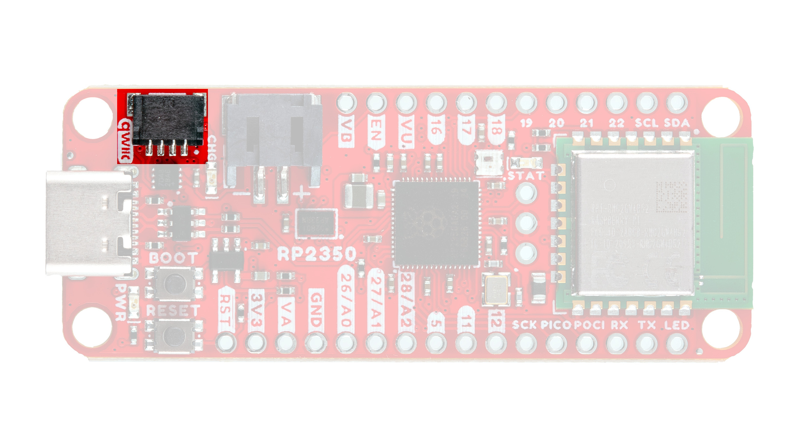{ width="600"}](./assets/img/Thing_Plus_RP2350-Qwiic.jpg "Click to enlarge")
</figure>

### PTH Headers

The Thing Plus's pair of PTH headers break out a selection of 21 GPIO pins from the RP2350 along with PTH connections to USB voltage (5V), regulated 3.3V, battery voltage, RP2350 reset signal, and the voltage regulator Enable pin. The board also has a "central" row of three 0.1"-spaced headers connected to the RP2350's internal Serial Wire Debug multi-drop bus. 

<figure markdown>
[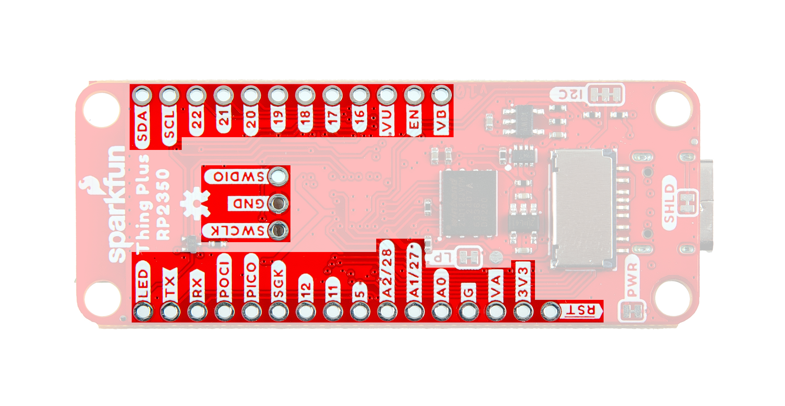{ width="600"}](./assets/img/Thing_Plus_RP2350-Pinout.jpg "Click to enlarge")
</figure>

The pinout includes connections to UART, I2C, SPI, 13 GPIO (3 of analog-capable pins) and the WS2812's DATA OUT pin.

## Buttons

There are two buttons on the board labeled <b>RESET</b> and <b>BOOT</b>. The RESET button is tied to the RP2350's RUN pin and resets the IC when pressed. The BOOT button puts the RP2350 into bootloader mode when held down during power on or reset. Read on to the <b>UF2 Bootloader</b> section of this guide for more information on using the bootloader.

<figure markdown>
[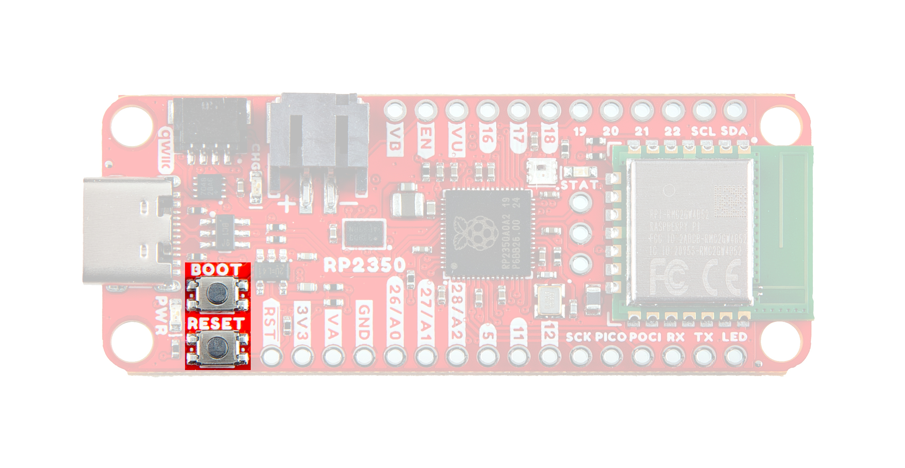{ width="600"}](./assets/img/Thing_Plus_RP2350-Buttons.jpg "Click to enlarge")
</figure>

## LEDs

The Thing Plus - RP2350 includes three labeled LEDs; <b>PWR</b>, <b>CHG</b> and <b>STAT</b> as well as a WS2812 RGB LED. 

<figure markdown>
[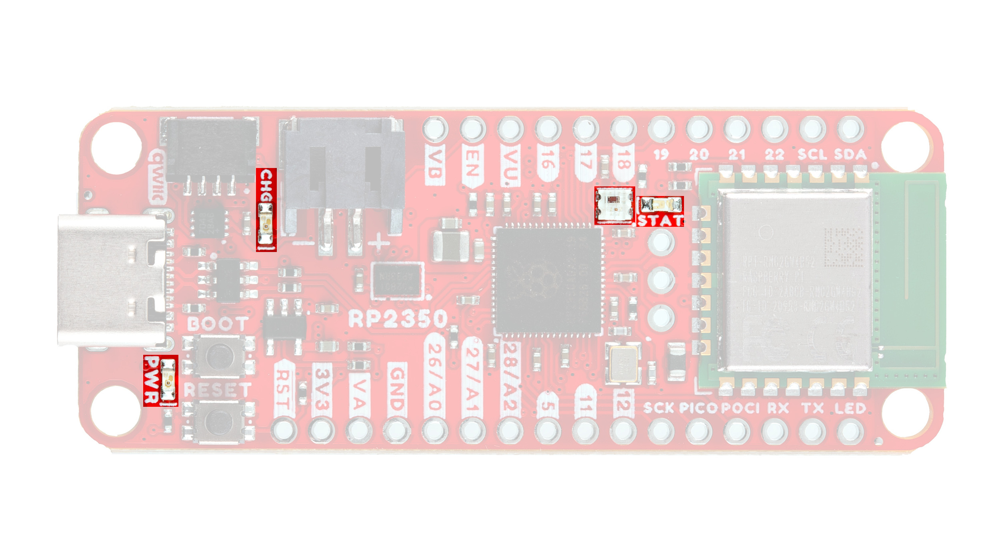{ width="600"}](./assets/img/Thing_Plus_RP2350-LEDs.jpg "Click to enlarge")
</figure>

The red <b>PWR</b> LED indicates when the <b>3.3V</b> rail is powered. The yellow <b>CHG</b> LED indicates when the charge circuit is powered with <b>5V</b> from either the USB-C connector or the V_USB PTH pin. The blue <b>STAT</b> LED is tied to the RM2 radio module GPIO0 to be used for indicating when the module is transmiting/receiving data. The WS2812 RGB LED's DATA IN pin is tied to the RP2350 GPIO14 pin. The RGB LED's DATA OUT pin is routed to the FREEBIE PTH (labeled LED on the board) if users want to daisy-chain more LEDs to the board.

## Jumpers

??? note "Never modified a jumper before?"
	Check out our <a href="https://learn.sparkfun.com/tutorials/664">Jumper Pads and PCB Traces tutorial</a> for a quick introduction!
	

		<a href="https://learn.sparkfun.com/tutorials/664">
		 
        How to Work with Jumper Pads and PCB Traces</a>
	

This Thing Plus has four solder jumpers labeled <b>PWR</b>, <b>I2C</b>, <b>LP</b>, and <b>SHLD</b>. 

<figure markdown>
[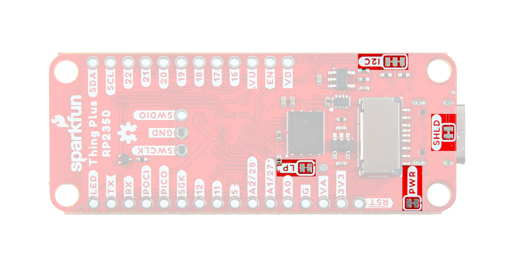{ width="600"}](./assets/img/Thing_Plus_RP2350-Jumpers.jpg "Click to enlarge")
</figure>

The <b>PWR</b> jumper completes the Power LED circuit and is CLOSED by default. Open the solder jumper by severing the trace in between the two pads to disable the Power LED if needed. 

The <b>I2C</b> jumper pulls the I2C lines (SDA/SCL) to <b>3.3V</b> through a pair of <b>2.2k&ohm;</b> resistors. This three-way jumper is CLOSED by default. Open the solder jumper to disable the pullup resistors on the I2C bus if needed.

The <b>LP</b> jumper controls whether the peripheral power regulator is always on or toggleable with an I/O pin (RP2350 GPIO13). This jumper is CLOSED by default so all peripherals (Qwiic connector, &micro;SD slot and RGB LED) are always powered on. Opening this jumper requires setting GPIO13 HIGH to enable peripheral power.

The <b>SHLD</b> jumper connects the USB-C connector's shield pin to the board's ground plane. This jumper is CLOSED by default. Open it to isolate the shield pin from the board.

## Board Dimensions

This board matches the Thing Plus footprint and measures 2.3" x 0.9" (58.42mm x 22.86mm) and includes four mounting holes that fit a [4-40 screw](https://www.sparkfun.com/products/10453). Note, the RM2 antenna comes very close to the "top" two mounting holes so take care when securing anything to these holes to avoid damaging the radio's antenna. 

<figure markdown>
[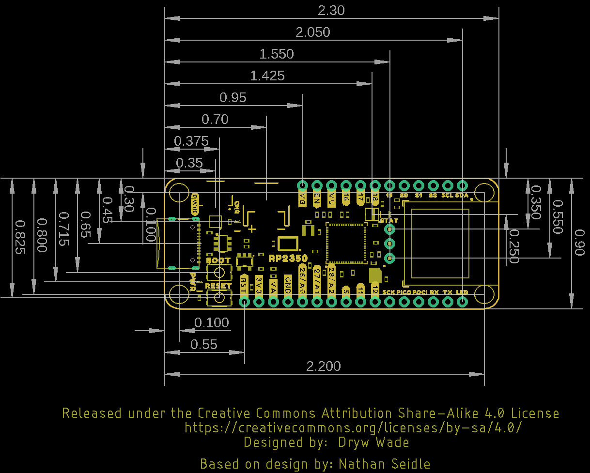{ width="600"}](./assets/board_files/SparkFun_Thing_Plus_RP2350-Dimensions.png "Click to enlarge")
</figure>

??? tip "Need more measurements?"
	For more information about the board's dimensions, users can download the [Eagle files](./assets/board_files/SparkFun_Thing_Plus_RP2350.zip) for the board. These files can be opened in Eagle and additional measurements can be made with the dimensions tool.

	??? info ":octicons-download-16:{ .heart } Eagle - Free Download!"
		Eagle is a [CAD]("computer-aided design") program for electronics that is free to use for hobbyists and students. However, it does require an account registration to utilize the software.

		

		[Download from :autodesk-primary:{ .autodesk }](https://www.autodesk.com/products/eagle/free-download "Go to downloads page"){ .md-button .md-button--primary width="250px" }
		

	
	??? info ":straight_ruler: Dimensions Tool"
		This video from Autodesk demonstrates how to utilize the dimensions tool in Eagle, to include additional measurements:

		

		

		<iframe src="https://www.youtube.com/embed/dZLNd1FtNB8" title="EAGLE Dimension Tool" frameborder="0" allow="accelerometer; autoplay; clipboard-write; encrypted-media; gyroscope; picture-in-picture" allowfullscreen></iframe>
		

		
