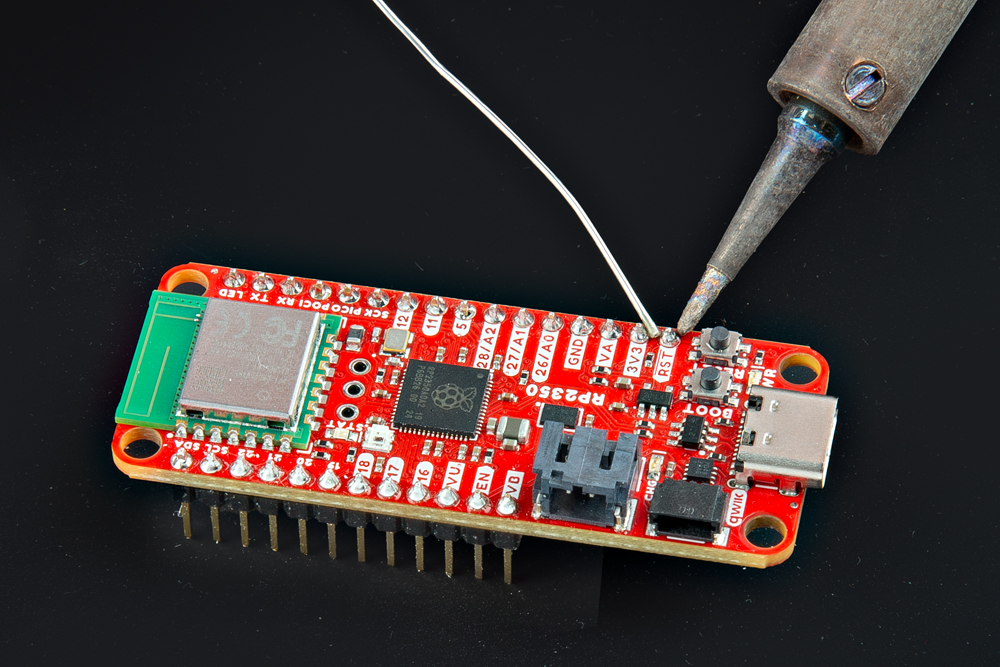
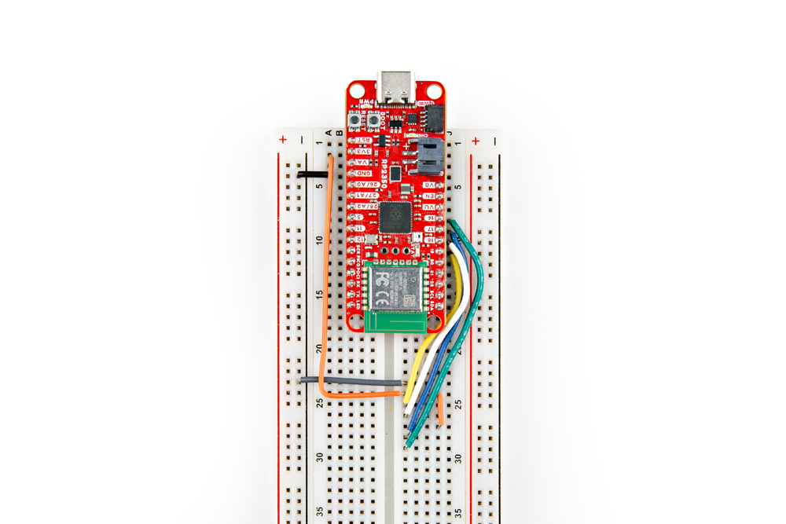
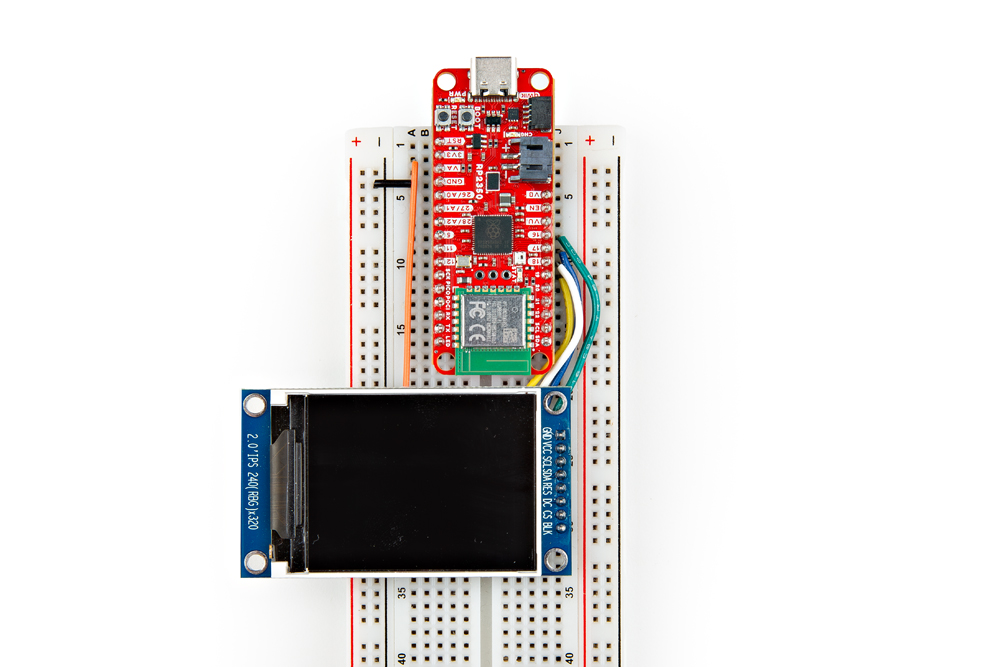
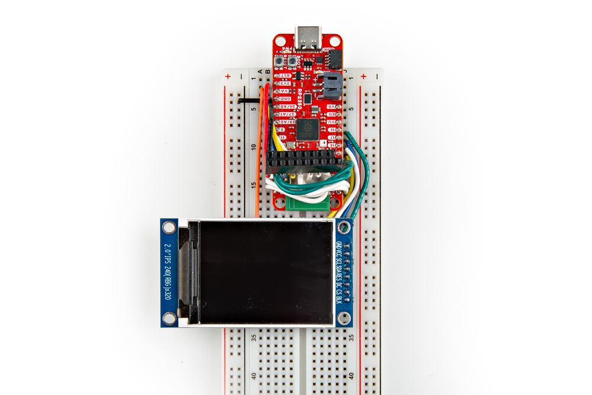
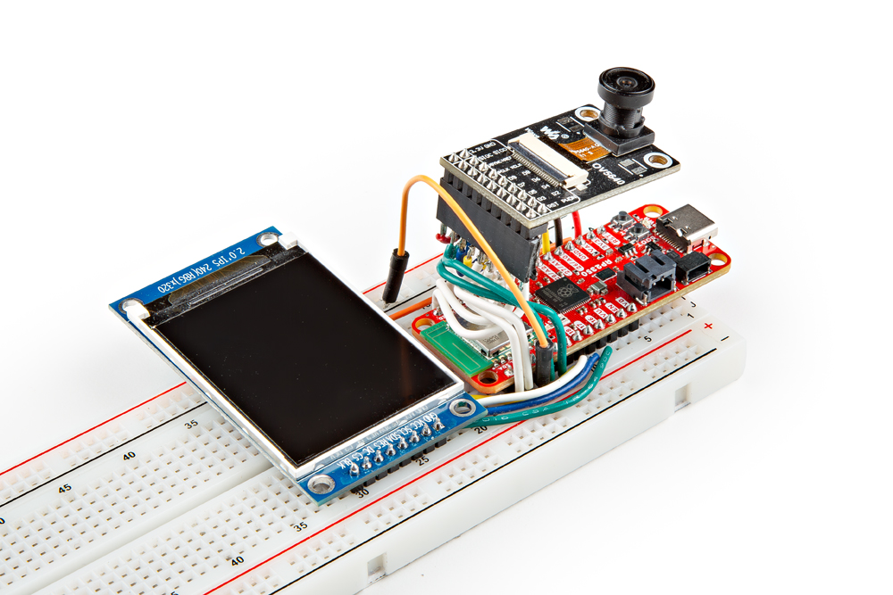

This Vision Demo lets you build an all-in-one image capture and display assembly run completely on the RP2350. We created this project to showcase the raw processing power and data transmission speeds of the RP2350 in a local environment. This project connects the waveshare OV5640 Camera Board along with a 2" LCD (coming soon to SparkFun!) to the RP2350 over SPI and the RP2350's HSTX-capable pins. The example takes a live video feed from the OV5460 and displays it with nearly no image lag at about 40fps. While this demo is only a local image, with some code modifications you could theoretically take the images and stream them over WiFi or Bluetooth to create a true IoT camera.

## Hardware Assembly

### Soldering

Before wiring anything up, make sure to solder headers (or wires if you prefer) to both the Thing Plus and the LCD board.

<figure markdown>
[{ width="600"}](./assets/img/Thing-Plus-RP2350-Camera-Demo-1.jpg "Click to enlarge.")
</figure>

### Display Wiring

The display used in this example connects over SPI along with a few other connections for power (VCC & GND), reset . The table below outlines the connections between the display and Thing Plus when read from Left to Right on the display.

<table>
    <tr>
        <th>Display Pin</th>
        <th>Thing Plus Pin</th>
        <th>Notes</th>
    </tr>
    <tr>
        <td>GND</td>
        <td>GND</td>
        <td>Any ground pin</td>
    </tr>
    <tr>
        <td>VCC</td>
        <td>3V3</td>
        <td>Power with 3.3V only</td>
    </tr>
    <tr>
        <td>SCL*</td>
        <td>19</td>
        <td>Clock signal</td>
    </tr>
    <tr>
        <td>SDA*</td>
        <td>18</td>
        <td>Data In. Called "Din" in example code.</td>
    </tr>
    <tr>
        <td>RES</td>
        <td>3V3</td>
        <td>Reset pin. Pulled HIGH to 3.3V</td>
    </tr>
    <tr>
        <td>DC*</td>
        <td>17</td>
        <td>SPI display data/command select pin.</td>
    </tr>
    <tr>
        <td>CS*</td>
        <td>16</td>
        <td>SPI Chip select.</td>
    </tr>
    <tr>
        <td>BLK</td>
        <td>NC</td>
        <td>Backlight pin.</td>
    </tr>
</table>

The photos below show the wiring before and after seating the LCD on the breadboard:

<figure markdown>
[{ width="600"}](./assets/img/Thing-Plus-RP2350-Camera-Demo-3.jpg "Click to enlarge")
</figure>

If you're following this wiring to the letter, take note of the orange jumper wire netting the display's Reset pin to VCC/3.3V. Also note to align the Backlight pin with pin 30 on the breadboard and everything else will match up.

<figure markdown>
[{ width="600"}](./assets/img/Thing-Plus-RP2350-Camera-Demo-4.jpg "Click to enlarge")
</figure>

### Camera Wiring

The camera wiring gets a bit more compliated than the display is it requires power and data signals as well as image processing signals that must be connected to sequential pins. Due to the design of the Thing Plus, this wiring may seem a bit confusing when looking at the board but if you refer to the [schematic](./assets/board_files/SparkFun_Thing_Plus_RP2350.pdf) you can match up GPIO pins 0 through 7 to their respective labels on the board. The table below outlines these pin connections along with the rest required to wire the camera breakout to the Thing Plus:

<table>
    <tr>
        <th>Camera Pin</th>
        <th>Thing Plus Pin Label</th>
        <th>Notes</th>
    </tr>
    <tr>
        <td>3.3V</td>
        <td>3V3</td>
        <td>3.3V only</td>
    </tr>
    <tr>
        <td>GND</td>
        <td>GND</td>
        <td>Any Ground pin</td>
    </tr>
    <tr>
        <td>SIOC</td>
        <td>21</td>
        <td>Clock signal. Paired with data to any I2C pin pair</td>
    </tr>
    <tr>
        <td>SIOD</td>
        <td>20</td>
        <td>Data signal. Paired with data to any I2C pin pair</td>
    </tr>
    <tr>
        <td>VSYNC</td>
        <td>A1/27</td>
        <td>Can be any GPIO pin</td>
    </tr>
    <tr>
        <td>HREF</td>
        <td>A2/28</td>
        <td>Can be any GPIO pin</td>
    </tr>
    <tr>
        <td>PCLK</td>
        <td>A0/26</td>
        <td>Can be any GPIO pin</td>
    </tr>
    <tr>
        <td>XCLK</td>
        <td>11</td>
        <td>Can be any GPIO pin</td>
    </tr>
    <tr>
        <td>D9</td>
        <td>SCL/7</td>
        <td>Must be sequential GPIO pins</td>
    </tr>
    <tr>
        <td>D8</td>
        <td>SDA/6</td>
        <td>Must be sequential GPIO pins</td>
    </tr>
    <tr>
        <td>D7</td>
        <td>5</td>
        <td>Must be sequential GPIO pins</td>
    </tr>
    <tr>
        <td>D6</td>
        <td>POCI/4</td>
        <td>Must be sequential GPIO pins</td>
    </tr>
    <tr>
        <td>D5</td>
        <td>PICO/3</td>
        <td>Must be sequential GPIO pins</td>
    </tr>
    <tr>
        <td>D4</td>
        <td>SCK/4</td>
        <td>Must be sequential GPIO pins</td>
    </tr>
    <tr>
        <td>D3</td>
        <td>RX/3</td>
        <td>Must be sequential GPIO pins</td>
    </tr>
    <tr>
        <td>D2</td>
        <td>TX/2</td>
        <td>Must be sequential GPIO pins</td>
    </tr>
    <tr>
        <td>RST</td>
        <td>-</td>
        <td>Not connected</td>
    </tr>
    <tr>
        <td>PWDN</td>
        <td>-</td>
        <td>Not connected</td>
    </tr>
</table>

We made an ad-hoc wiring "harness" for the camera board by soldering wires to a couple of trimmed [female headers](https://www.sparkfun.com/products/115) so please excuse the wiring mess in the photos below show. The photos below show the wiring for the camera with and without the camera board connected to our harness. Users can try and recreate this or if you're making a more permanent installation you can solder wires directly between all three boards. Alternatively, you could use some jumper wires (perhaps either [male/female](https://www.sparkfun.com/products/12794) or [female/female](https://www.sparkfun.com/products/12796)).

<figure markdown>
[{ width="600"}](./assets/img/Thing-Plus-RP2350-Camera-Demo-6.jpg "Click to enlarge")
</figure>

<figure markdown>
[{ width="600"}](./assets/img/Thing-Plus-RP2350-Camera-Demo-7.jpg "Click to enlarge")
</figure>

### Threshold Pin

The code also includes a thresholding pin set to GPIO22 on the Thing Plus. Connect this pin to ground using a jumper wire. The threshold pin is configured as an input with pull-up so it starts as disabled (22 connected to GND) and can be enabled by disconnecting the wire from ground. The images above and below show this connection using an Orange jumper wire.

### Completed Assembly

Make sure everything is wired correctly and your completed assembly might look something like the photo below:

<figure markdown>
[{ width="600"}](./assets/img/Thing-Plus-RP2350-Camera-Demo-8.jpg "Click to enlarge.")