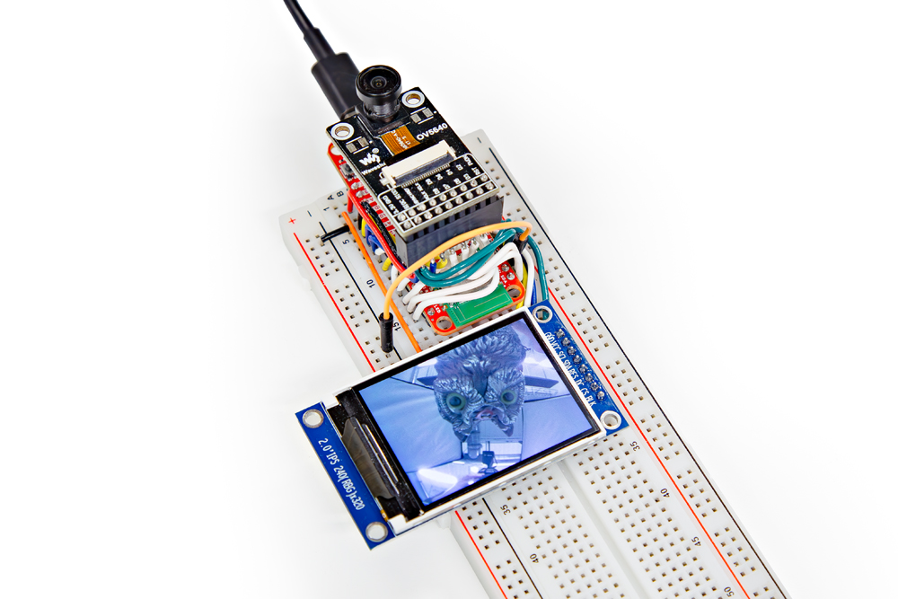

## Software Requirements

This example is written for Arduino and requires the IDE, the Thing Plus - RP2350 board definition included in the Arduino Pico boards package as well as the SparkFun iCap OV5640 and SparkFun HSTX ST7789 Arduino libraries. Make sure you've gone through the boards package installation instructions in the [Arduino Setup section](./arduino_setup.md) of this guide and then follow the instructions below to install the required libraries.

### Required Libraries

The example requires the SparkFun ImageCapture and RP2 HSTX ST7789 Arduino Libraries. You can install them through the Library Manager in the Arduino IDE by searching for <b>"SparkFun ImageCapture"</b> and <b>"SparkFun RP2 HSTX ST7789"</b> and install the latest version. Alternatively, you can download a ZIP of each library to manually install them by clicking the buttons below:

<center>
	[SparkFun ImageCapture Arduino Library (ZIP)](https://github.com/sparkfun/SparkFun_ImageCapture_Arduino_Library/archive/refs/heads/main.zip){ .md-button .md-button--primary}
</center>

<center>
	[SparkFun RP2 HSTX ST7789 Arduino Library (ZIP)](https://github.com/sparkfun/SparkFun_RP2_HSTX_ST7789_Arduino_Library/archive/refs/heads/main.zip){ .md-button .md-button--primary}
</center>

With the libraries installed, let's move on to uploading the code.

## Vision Demo Example Code

The example code for this demo can be found in the [Thing Plus - RP2350 GitHub Repository](https://github.com/sparkfun/SparkFun_Thing_Plus_RP2350/tree/main/Examples/Vision_Demo) in the "Examples/Vision_Demo" folder. You can find it from the link above or download a ZIP of the entire repository by clicking the button below:

<center>
    [Thing Plus - RP2350 GitHub Repo (ZIP)](https://github.com/sparkfun/SparkFun_Thing_Plus_RP2350/archive/refs/heads/main.zip){ .md-button .md-button--primary}    
</center>

Open up the example in Arduino or open a blank sketch and copy the code below:

??? "Vision Demo"
	```
	--8<-- "https://raw.githubusercontent.com/sparkfun/SparkFun_Thing_Plus_RP2350/refs/heads/main/Examples/Vision_Demo/Vision_Demo.ino"
	```

Select the board (SparkFun Thing Plus - RP2350) and port and click the "Upload" button. Once the code finishes uploading, you should see the screen turn on and start displaying a live feed from the camera. 

<figure markdown>
[{ width="600"}](./assets/img/Thing-Plus-RP2350-Camera-Demo-9.jpg "Click to enlarge")
</figure>

If the screen remains black, press the Reset button on the Thing Plus and it should start up after that. If you do not see anything, open the Serial Monitor in Arduino with the baud set to <b>115200</b>, reset the board again and check to see if the camera connection error message prints. If it does, double check the wiring to make sure everything is connected properly.